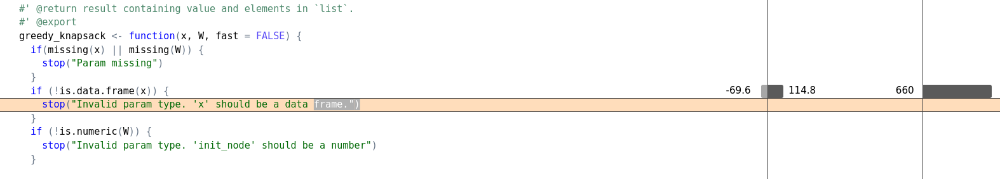
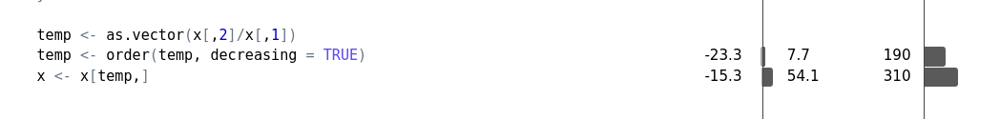

```{r, include = FALSE}
knitr::opts_chunk$set(
  collapse = TRUE,
  comment = "#>"
)
library(profvis)

```

```{r setup}
library(lab6)
RNGversion(min(as.character(getRversion()),"3.5.3"))
set.seed(42, kind = "Mersenne-Twister", normal.kind = "Inversion")
n <- 2000
knapsack_objects <-
data.frame(
w=sample(1:4000, size = n, replace = TRUE),
v=runif(n = n, 0, 10000)
)

```

### How the Functions work

This package includes three functions to solve the knapsack problem. All the functions have 2 inputs: 1. "x" (A data frame with 2 columns which include w (weight)and v (value)) and "W" (the total capacity of the knapsack).
All the functions return a list including the maximum value (A list which includes the total value of all the items and all the elements that are in the knapsack).

#### Brute Force Algorithm
This first function solves the knapsack problem by evaluating every possible combination of elements in the knapsack and calculating their weight. 

```{r}
starttime <- Sys.time()
brute_force_knapsack(x = knapsack_objects[1:16,], W = 3500)
endtime <- Sys.time()

```

#### Q1 :How much time does it takes to run the algorithm (brute force) for n = 16 objects?
```{r}
print(endtime-starttime)
```
#### Dynamic Programming
The second function solves the problem by iterating over all possible values of w. 

```{r}
starttime <- Sys.time()
dynamic_programming_knapsack (x = knapsack_objects[1:500,], W = 3500)
endtime <- Sys.time()
```

#### Q2 :How much time does it takes to run the algorithm (dynamic) for n = 500 objects?
```{r}
print(endtime-starttime)
```
#### Greedy Algorithm
The third function does not always find the optimal solution to the problem but reduces the computational complexity considerably.

```{r, results='hide'}
n <- 1000000
knapsack_objects <-
data.frame(
w=sample(1:4000, size = n, replace = TRUE),
v=runif(n = n, 0, 10000)
)

starttime <- Sys.time()
greedy_knapsack (x = knapsack_objects[1:1000000,], W = 3500, fast = FALSE)
endtime <- Sys.time()

```

#### Q3:vHow much time does it takes to run the algorithm (greedy) for n = 1000000 objects?

```{r}
print(endtime-starttime)
```


By running the C++ Code for Greedy algorithm, the run time will be optimized. As you see in the code, if the "fast" is TRUE, the C++ code will run, and if it is FALSE, the R code will run.

#### Q4: What performance gain could you get by trying to improving your code?
```{r}
n <- 2000
knapsack_objects <-
  data.frame(
    w=sample(1:4000, size = n, replace = TRUE),
    v=runif(n = n, 0, 2000)
    )

profvis::profvis(greedy_knapsack (x = knapsack_objects[1:1000000,], W = 3500, fast = TRUE))
```
After running the profvis function on greedy_knapsack we find out that out condition to verify that the input has dataframe, is taking up the most chunk of the time and memory. The following is the code and its result

```{r, eval=FALSE}
if (!is.data.frame(x)) {
  stop("Invalid param type. 'x' should be a data frame.")
}
```



furthermore we also find out that out that the following code is also taking some memory and space
```{r, eval=FALSE}
temp <- order(temp, decreasing = TRUE)
x <- x[temp,]
```




#### Q5: What performance gain could you get by using Rcpp and C++?

```{r}
n <- 10000000
knapsack_objects <-
data.frame(
w=sample(1:4000, size = n, replace = TRUE),
v=runif(n = n, 0, 2000)
)
```

By using Rcpp the time difference is the following 
```{r, results='hide'}
starttime <- Sys.time()
greedy_knapsack (x = knapsack_objects, W = 3500, fast = TRUE)
endtime <- Sys.time()
```
```{r}
print(endtime-starttime)
```

Without using Rcpp the time difference is the following 
```{r, results='hide'}
starttime <- Sys.time()
greedy_knapsack (x = knapsack_objects, W = 3500, fast = FALSE)
endtime <- Sys.time()

```
```{r}
print(endtime-starttime)

```
